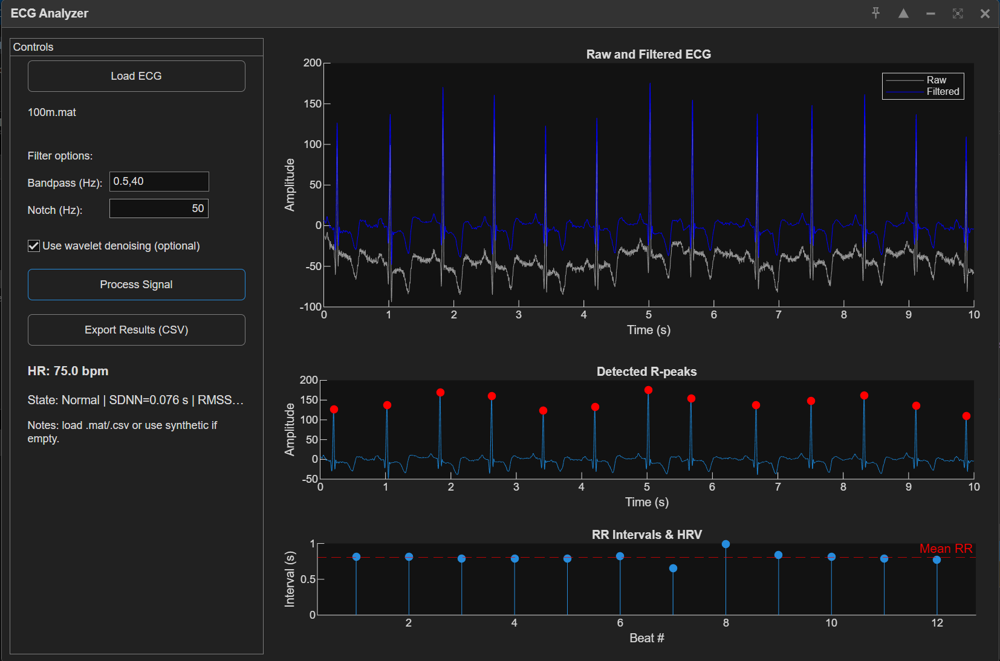
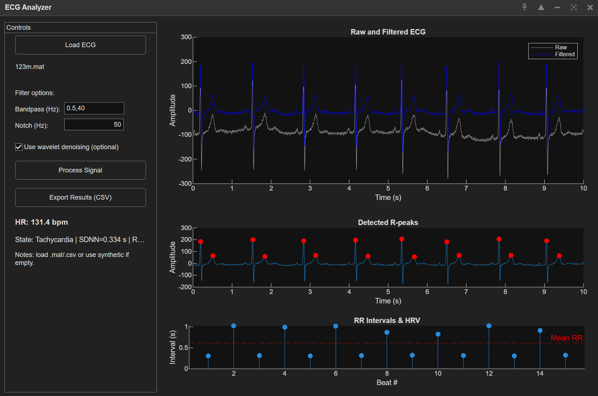

# ECG Signal Processing using MATLAB

This project demonstrates the complete workflow of **ECG (Electrocardiogram) signal processing**, from raw data filtering to R-peak detection and heart rate analysis.  
It also includes an interactive **Graphical User Interface (GUI)** built using MATLAB App Designer.

---

## Features
- Powerline interference removal using a notch filter  
- Bandpass filtering to isolate ECG frequency bands  
- R-peak detection for heart rate calculation  
- Visual plots of raw vs filtered signals  
- Heart rate classification (Normal, Bradycardia, Tachycardia)

---

## Project Structure

```
ECG_Project/
│
├── ECG_Signal_Processing.m # Main processing pipeline
├── ECG_Powerline_Interference.m # Filter for 50/60 Hz noise
├── ECG_RPeak_Detection.m # R-peak detection logic
├── ECG_App.mlapp # GUI created in MATLAB App Designer
├── sample_ecg.mat # Sample ECG data (optional)
└── README.md
```
---

## How it Works
1. The raw ECG signal is loaded or recorded.  
2. A **notch filter** removes powerline noise (50/60 Hz).  
3. A **bandpass filter** isolates heart activity frequencies (0.5–40 Hz).  
4. **R-peaks** are detected using thresholding or derivative methods.  
5. The **heart rate (BPM)** is calculated from the time difference between peaks.  
6. Classification labels the result:
   - **Normal**: 60–100 BPM  
   - **Bradycardia**: <60 BPM  
   - **Tachycardia**: >100 BPM  


---

## Usage
1. Open MATLAB or MATLAB Online  
2. Set the current folder to `ECG_Project`  
3. Run:
   ```matlab
   ECG_App
   ```




## Future Improvements

- Integration with real ECG acquisition devices

- Automatic anomaly detection using machine learning

- Export to CSV/PDF reports